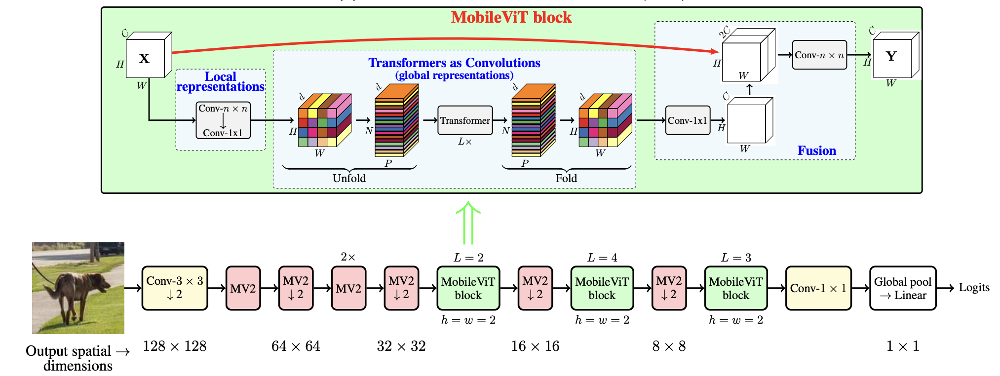
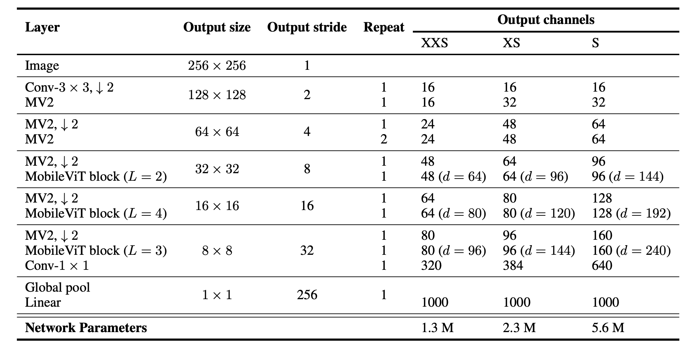

MobileViT Implementation in Tensorflow2

## Introduction
This repository contains tensorflow2 implementation of [MobileViT](https://arxiv.org/abs/2110.02178).




## Dependencies
```
pip install -r requirements.txt
```
## Usage
```
python train.py --ep 50 --bs 16 --data 'cifar10'
```


